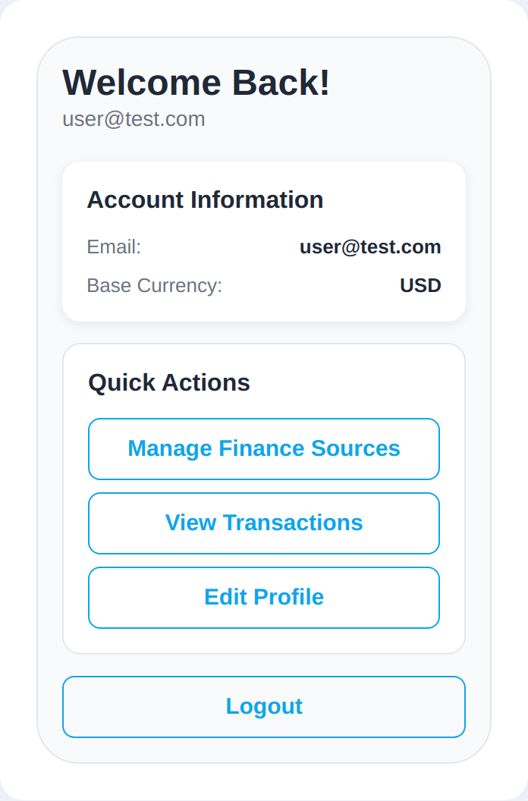
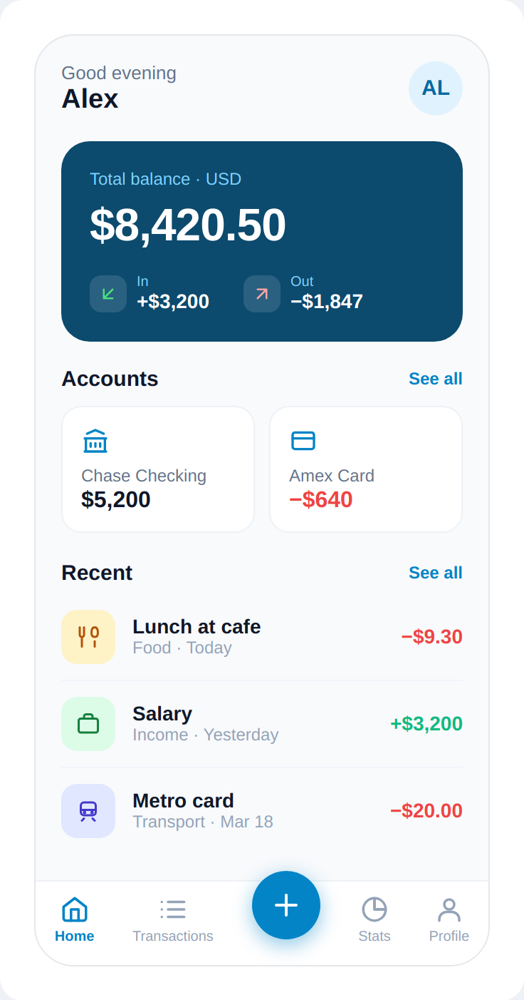
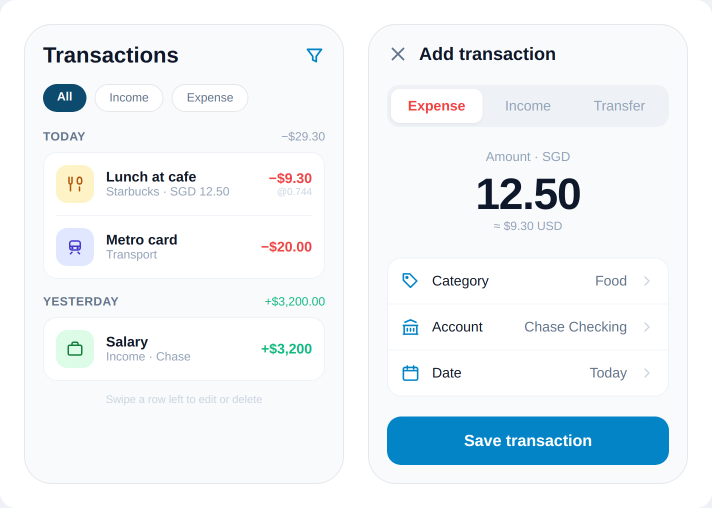
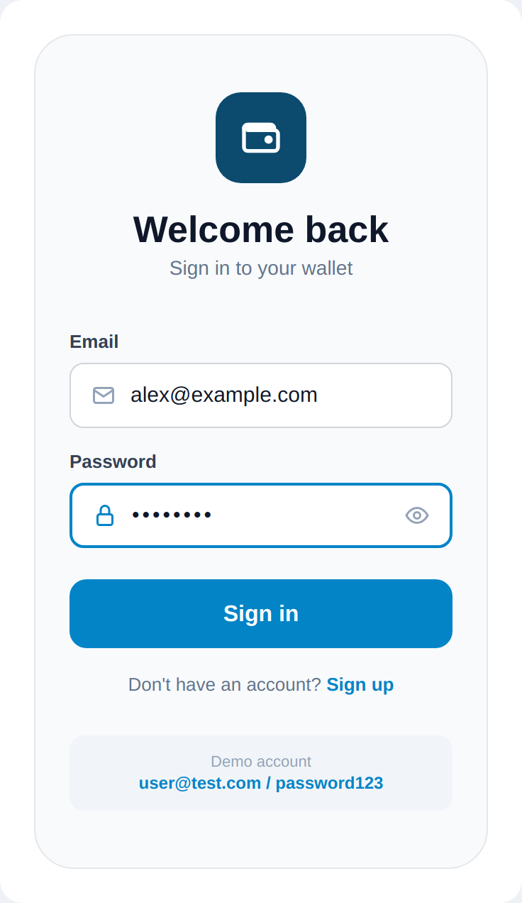

# Wallet App — 前端 UI 设计规范

> 版本 1.0 · 2026-05-24
> 适用范围：Wallet App 前端（Expo / React Native + React Native Web）
> 设计基调：Clean Fintech — 克制、专业、信息清晰。保留现有 sky-blue 品牌色，引入深海蓝作为重点色。

---

## 0. 阅读指引

本文档是一份**面向落地的设计方案**，不是需求清单。它描述「界面应该长成什么样、为什么这样、怎么实现」。

文档分三层：

1. **设计 token**（颜色 / 字号 / 间距 / 圆角 / 阴影）— 一切视觉的基础变量。
2. **组件规范** — 按钮、卡片、输入框、列表行、底部导航等可复用单元。
3. **屏幕规范** — 每个核心屏幕的布局、构成、交互。

文末有「落地注意事项」一节，记录与现有代码、与后端、与 phase 规划相关的关键决策，**请务必读完**——其中包括首页强依赖的「余额聚合」这一后端前置项。

---

## 1. 现状与目标

### 1.1 现状

当前前端功能完整（M1 已上线：登录、账户、交易、多货币换算、转账），但视觉与信息架构偏「默认 / 朴素」：

- 组件全部用 `StyleSheet.create()` + 硬编码 hex（NativeWind 虽配置但未实际使用，属半成品迁移状态）。
- 首页是一个「信息确认页」——打开看到的是 Email、Base Currency 这类设置信息，而不是用户最关心的余额 / 收支 / 最近流水。
- 用 emoji 当图标（💳💰⚙️），不够正式统一。
- 交易卡片信息密度高（Original / In USD / 汇率三行叠加），扫读累；每张卡片常驻 Edit / Delete 按钮，占空间且显得工具化。
- 导航为手搓的全屏切换，无底部 tab、无返回历史。

下图为忠实还原的**现有首页**：



### 1.2 目标

中等野心的重构——**保留品牌色，重构信息架构，引入仪表盘与底部导航**：

- 首页从「信息页」升级为「仪表盘」：总余额、本月收支、账户余额、最近交易一屏可见。
- 引入底部 tab 导航（Home / Transactions / [+] / Stats / Profile），把最高频的「记一笔」放在最显眼的中央按钮。
- 统一为线性图标体系，去除 emoji。
- 简化交易列表：按日期分组、压缩汇率信息、滑动操作替代常驻按钮。
- 视觉走 clean fintech：深海蓝做重点块，sky-blue 做交互色，浅灰白底，柔和分类色块。

---

## 2. 设计 Token

所有数值是落地时的唯一事实来源。建议在前端集中定义为一个 `theme.ts`（见 §6.2）。

### 2.1 颜色

#### 品牌 / 交互色

| Token | Hex | 用途 |
|---|---|---|
| `brand.deep` | `#0c4a6e` | 余额主卡背景、强调标签、品牌 logo 底 |
| `brand.primary` | `#0284c7` | 主按钮、激活态、链接、FAB、聚焦边框 |
| `brand.sky` | `#0ea5e9` | 旧主色（保留向后兼容；新界面优先用 `brand.primary`） |
| `brand.tintBg` | `#e0f2fe` | 头像底、浅强调背景 |
| `brand.onDeep` | `#7dd3fc` | 深蓝卡上的次要文字 |

> 说明：现有代码主色是 `#0ea5e9`。新方案把交互主色**收深一档**到 `#0284c7`（sky-600），视觉更稳重、对比更足；`#0ea5e9` 仍可保留为兼容值。深海蓝 `#0c4a6e`（sky-900 附近）是新引入的重点色，只用在余额卡这类「主角」上。

#### 中性色（文字 / 背景 / 边框）

| Token | Hex | 用途 |
|---|---|---|
| `text.strong` | `#0f172a` | 主标题、金额、关键数字 |
| `text.body` | `#334155` | 正文、表单 label |
| `text.muted` | `#64748b` | 次要文字、说明 |
| `text.faint` | `#94a3b8` | 占位、时间戳、分类副标 |
| `text.ghost` | `#cbd5e1` | 极弱信息（如汇率角标、chevron） |
| `bg.screen` | `#f8fafc` | 屏幕背景 |
| `bg.surface` | `#ffffff` | 卡片 / 输入框背景 |
| `bg.subtle` | `#f1f5f9` | 分段控件槽、弱信息块底 |
| `border.default` | `#e5e7eb` | 卡片边框、分隔 |
| `border.faint` | `#eef2f6` | 内部弱分隔 |
| `border.input` | `#d1d5db` | 输入框默认边框 |

#### 语义色（金额 / 状态）

| Token | Hex | 用途 |
|---|---|---|
| `semantic.income` | `#10b981` | 收入金额（正） |
| `semantic.expense` | `#ef4444` | 支出金额（负）、危险操作 |
| `semantic.incomeStrong` | `#15803d` | 收入分类图标 |
| `semantic.expenseSoft` | `#fca5a5` | 深蓝卡上的支出箭头 |
| `semantic.incomeSoft` | `#4ade80` | 深蓝卡上的收入箭头 |

> 收入绿 `#10b981` 沿用现有代码（`TransactionsScreen` 里已用此值），保持一致。

#### 分类色板（图标底块）

交易分类用「柔和底色 + 同色系深色图标」的方式区分。建议的高层分类映射（与 SPEC §1.7 的推荐分类对齐）：

| 分类 | 底色 | 图标色 |
|---|---|---|
| Food | `#fef3c7` | `#b45309` |
| Income | `#dcfce7` | `#15803d` |
| Transport | `#e0e7ff` | `#4338ca` |
| Housing | `#fae8ff` | `#a21caf` |
| Entertainment | `#ffe4e6` | `#be123c` |
| Other / 默认 | `#f1f5f9` | `#475569` |

> 这是一组「柔和底 + 800 档文字色」的搭配规律，新增分类时按同样规律扩展即可。

### 2.2 字号 / 字重

只用两档字重：`400` regular、`700` bold（金额与标题用 bold）。

| 角色 | 字号 | 字重 | 颜色 |
|---|---|---|---|
| 余额大数字 | 32 | 700 | `#ffffff`（深蓝卡上） |
| 记账金额输入 | 44 | 700 | `text.strong` |
| 屏幕标题 | 22 | 700 | `text.strong` |
| 区块标题（Accounts / Recent） | 15 | 600 | `text.strong` |
| 列表行主文 | 14 | 600 | `text.strong` |
| 金额（行内） | 14 | 700 | 语义色 |
| 正文 / 选项值 | 14 | 400 | `text.body` / `text.muted` |
| 副标 / 时间 | 12 | 400 | `text.faint` |
| 分组标签（TODAY 等） | 12 | 600 | `text.muted`，字间距 0.4 |
| 角标（汇率等） | 10 | 400 | `text.ghost` |

字间距：大数字用 `-0.5` ~ `-1` 的负字距更紧凑专业。

### 2.3 间距

基于 4px 网格（沿用现有约定）。常用：`8 / 12 / 16 / 18 / 20 / 24`。

- 屏幕内边距：`18`（比现有的 16 略宽，更透气）。
- 卡片内边距：`13`（账户小卡）/ `16`（标准卡）/ `20`（余额主卡）。
- 列表行垂直内边距：`11`–`13`。

### 2.4 圆角

| Token | 值 | 用途 |
|---|---|---|
| `radius.sm` | 8 | 旧按钮（兼容） |
| `radius.md` | 10–11 | 输入框、列表内图标块 |
| `radius.lg` | 14 | 卡片、按钮（新） |
| `radius.xl` | 18–20 | 余额主卡、品牌 logo |
| `radius.pill` | 16 | 筛选 chip |
| `radius.full` | 50% | 头像、FAB |

### 2.5 阴影

克制使用。仅两处：

- 卡片浮起：`0 2px 8px rgba(0,0,0,0.08)`（沿用现有 `Card` elevated；Android 用 `elevation: 3`）。
- FAB（中央 + 按钮）：`0 4px 14px rgba(2,132,199,0.45)`（带主色的彩色阴影，强调可点）。

其余一律用 `0.5–1px` 边框区分层级，不用阴影。

---

## 3. 组件规范

### 3.1 Button

保留现有 `variant × size` API，调整数值：

- 圆角统一到 `14`（新），文字 `600`。
- 主按钮：`brand.primary` 底 + 白字。
- 次按钮：白底 + `brand.primary` 1px 边 + `brand.primary` 字。
- 危险按钮：`semantic.expense` 底 + 白字。
- **触摸目标**：`small` 尺寸补 `minHeight: 44, minWidth: 44`（这点与 phase-05 的 MOBUI-01 一致，可直接沿用其结论）。

### 3.2 Card

三种变体维持：`default`（白底）/ `outlined`（白底 + `border.default`）/ `elevated`（白底 + 浮起阴影）。圆角统一 `14`。

- 余额主卡是特例：深海蓝底、圆角 `20`、白字，单独成一类 `BalanceCard`，不走通用 Card。

### 3.3 Input

沿用现有结构（label + 输入 + error/hint），调整：

- 默认边框 `border.input` 1px，聚焦态 `brand.primary` 2px（现有逻辑已是如此，保留）。
- 新增**前置图标槽**（如登录页邮箱前的信封、密码前的锁）：图标 `text.faint`，聚焦时可变 `brand.primary`。
- 输入文字 `fontSize: 16`（务必 ≥16，防 iOS Safari 聚焦缩放；与 phase-05 MOBUI-03 一致）。

### 3.4 ListRow（交易行 / 选项行）— 新增组件

统一的「图标块 + 主副文 + 右侧值」结构，全 app 复用：

```
[ 38×38 圆角色块图标 ]  主文(14/600)        右侧值
                        副文(12/faint)      （金额或 chevron）
```

- 图标块：`38×38`，圆角 `11`，分类色底 + 分类图标。
- 行内分隔：同组多行合并进一张卡，用 `1px border.faint` 分隔，而非每行独立卡片。
- 交易行右侧：金额（语义色，14/700）+ 可选汇率角标（10/ghost）。

### 3.5 SegmentedControl（分段切换）— 新增组件

用于记账表单的 Expense / Income / Transfer 切换：

- 容器：`bg.subtle` 底，圆角 `12`，内边距 `4`。
- 激活段：白底浮起（`0 1px 3px rgba(0,0,0,0.06)`），圆角 `9`；Expense 激活用 `expense` 红字，Income 用 `income` 绿字（语义化更直觉）。
- 非激活段：`text.faint` 字。

### 3.6 FilterChip（筛选 chip）— 新增组件

交易列表顶部 All / Income / Expense：

- 激活：`brand.deep` 底 + 白字。
- 非激活：白底 + `border.default` 1px + `text.muted` 字。
- 圆角 `16`（pill），内边距 `6 × 14`。

### 3.7 BottomTabBar（底部导航）— 新增组件

- 5 槽：Home / Transactions / [中央 FAB +] / Stats / Profile。
- 高度约 `64`，白底 + 顶部 `1px border.faint`，底部留 safe-area inset。
- 普通 tab：图标 `21` + 文字 `10`；激活态 `brand.primary`，非激活 `text.faint`。
- 中央 FAB：`48×48` 圆形，`brand.primary` 底，白色 `+`，`margin-top: -20` 上凸，带彩色阴影。

### 3.8 图标

**去除所有 emoji，改用线性图标库。** 推荐 `lucide-react-native`（RN 生态主流、线性风格、与本设计的图标观感一致）。常用映射：

| 用途 | lucide 图标 |
|---|---|
| Home tab | `home` |
| Transactions tab | `list` |
| Stats tab | `pie-chart` |
| Profile tab | `user` |
| 记一笔 FAB | `plus` |
| 银行账户 | `landmark` / `building-bank` |
| 信用卡 | `credit-card` |
| 收入 | `briefcase` / `arrow-down-left` |
| 支出 | `arrow-up-right` |
| 餐饮 | `utensils` |
| 交通 | `train` / `bus` |
| 分类 | `tag` |
| 日期 | `calendar` |
| 筛选 | `filter` |
| 关闭 | `x` |
| 钱包 logo | `wallet` |

---

## 4. 屏幕规范

### 4.1 首页 / 仪表盘（Home）



**目标**：用户打开第一眼看到「我有多少钱、这个月进出多少、各账户余额、最近花在哪」。

**自上而下构成**：

1. **问候栏**：左侧「Good evening / 用户名」，右侧头像（首字母圆形，`brand.tintBg` 底）。
2. **余额主卡**（深海蓝）：
   - 顶部小字「Total balance · USD」。
   - 大数字总余额（32/700 白字）。
   - 底部并排「In / Out」本月收支，各带一个半透明小图标块（箭头）。
3. **Accounts 区块**：标题行（左标题 + 右「See all」），下方横向并排账户小卡（图标 + 名称 + 余额；信用卡负值标红）。
4. **Recent 区块**：标题行 + 最近 3 条交易（用 §3.4 ListRow，无分隔卡，直接列表）。
5. **底部 tab bar**（§3.7）。

**注意**：总余额、账户余额、本月收支都是**聚合计算值**，后端当前不直接提供（见 §6.3）。

### 4.2 交易列表（Transactions）

（左屏）

**改进点**：

- 顶部标题 + 筛选图标；下方 FilterChip 行（All / Income / Expense）。
- **按日期分组**：每组一个分组标签（TODAY / YESTERDAY / 具体日期），右侧显示当天净额（绿/红）。
- 同一天的多笔交易**合并进一张卡**，行间用 `1px` 分隔，而非每笔一张厚卡片。
- 汇率信息从原来的三行压缩为右下角一个 `@0.744` 角标（10/ghost）。
- **去掉常驻的 Edit / Delete 按钮**，改为**左滑操作**（底部提示「Swipe a row left to edit or delete」）。Web 端可用 hover 显形或行尾「⋯」菜单替代滑动。

### 4.3 记账表单（Add / Edit Transaction）

（右屏）

记账是**最高频动作**，由底部 FAB 进入。设计重点是「快」：

- 顶部：关闭 `×` + 标题。
- **SegmentedControl**（§3.5）：Expense / Income / Transfer。Expense 激活红字、Income 绿字。
- **超大金额区**：居中，顶部「Amount · 货币」，中间 44px 大数字，下方实时显示换算后基准货币金额（`≈ $9.30 USD`）——呼应多货币这一核心卖点。
- **属性行卡片**：Category / Account / Date 三行（用 ListRow 变体，右侧值 + chevron，点击进入各自选择器）。原表单 1019 行的庞杂字段，收成可点的行，降低视觉负担。
- 底部：主按钮「Save transaction」。

> 转账模式（Transfer）下，表单会展开「从 → 到」两个账户与两个金额（对应后端 `transfer_pair_id` 配对逻辑）。本规范图示为 Expense 态；Transfer 态在落地时复用同套组件扩展。

### 4.4 登录 / 注册（Login / Register）



**改进点**：

- emoji 💰 换成品牌 logo：深海蓝圆角方块内放白色 `wallet` 图标。
- 标题「Welcome back / Sign in to your wallet」，留白舒展。
- 输入框带前置图标（邮箱信封、密码锁），聚焦态 `brand.primary` 2px 边框。
- 主按钮「Sign in」。下方「Sign up」切换链接。
- Demo 账户提示保留，但收进 `bg.subtle` 灰块，不抢视觉。

注册页同款风格，多一个 base currency 选择字段。

### 4.5 其余屏幕（沿用规范，未单独出图）

- **Profile**：承接原首页移出的设置信息（base currency、default source、邮箱、登出）。用 ListRow 组织各项。
- **Finance Sources（账户管理）**：账户列表用 ListRow（图标 + 名称 + 类型/余额），FAB 或顶部「+」新增；编辑表单复用 Input + Button。
- **Stats（统计，新 tab）**：本规范预留位置（饼图/趋势图），属后续 milestone（SPEC M4），此处不展开。

---

## 5. 设计原则速记

1. **金额是主角**：余额、交易金额永远是屏幕里最大/最重的元素。
2. **颜色编码意义**：绿=收入、红=支出贯穿全 app，不挪作他用。
3. **深蓝点睛**：`brand.deep` 只用在「主角块」（余额卡、logo、激活 chip），不滥用。
4. **线性图标统一**：禁用 emoji。
5. **两档字重**：400 / 700，靠字号和颜色而非更多字重做层级。
6. **边框优先于阴影**：层级用 0.5–1px 边框，阴影只留给浮起卡和 FAB。
7. **触摸友好**：可点元素 ≥44×44，输入字号 ≥16。

---

## 6. 落地注意事项（重要）

### 6.1 与 phase-05 的关系

phase-05（PWA 化 + 移动端打磨）已有详尽的执行计划，其范围**锁定在现有视觉与组件外观之上**做 PWA 和可用性改造（manifest、SW、44×44 触摸目标、safe-area、16px 输入等）。

本 UI 方案是**信息架构与视觉的重构**，野心超出 phase-05 的「打磨」定位，更接近一个新的 phase。两者关系：

- phase-05 的 MOBUI-01（44×44）、MOBUI-03（16px 输入）等结论**与本方案一致**，可直接继承，不冲突。
- 本方案的「底部 tab + 仪表盘 + 交易列表重构」应规划为 phase-05 **之后**的独立 phase（们）。具体 phase 切分由你来定。

### 6.2 集中化主题

现状是 hex 散落在各组件的 `StyleSheet.create()` 里（SPEC §2.9.8 描述的「半成品 NativeWind 迁移」）。落地本方案时建议：

- 新建 `src/theme/tokens.ts` 把 §2 所有 token 定义为常量，组件引用常量而非硬编码 hex。
- 是否同时完成 NativeWind 迁移（或干脆移除未用的 NativeWind 配置）由你决定——本方案对二者都兼容，但**至少应集中 token**，否则改色要改几十处。

### 6.3 首页强依赖「余额聚合」——后端前置项

首页仪表盘的「总余额 / 账户余额 / 本月收支」**后端当前不提供**：数据库只有 `transactions` 流水，没有 account balance 字段，也没有汇总接口。

落地首页前，需要后端先加聚合能力。两个方向：

- **（推荐）后端加聚合接口**，例如：
  - `GET /summary` → 返回基准货币下的总余额、本月 income/expense 合计。
  - `GET /finance-sources` 扩展返回每个 source 的 `balance`（按其下交易累加，必要时按汇率换算）。
- **前端聚合**：拉全部交易在前端累加。简单但随数据量增长会变慢、且多货币换算要前端处理，不推荐作为长期方案。

> 你已确认：先开一个 phase 让后端把聚合接口加上，前端 UI 重构放到后续 phase。本方案的首页设计正是基于「后端会提供聚合数据」这一前提。若聚合接口短期内不可用，首页可降级为「最近交易 + 本月支出（纯前端按现有交易可算）」的精简版，待接口就绪再补余额卡。

### 6.4 图标库

引入 `lucide-react-native`（需 `react-native-svg` 作为 peer 依赖，项目已有 reanimated/gesture-handler，svg 通常一并具备，确认即可）。全 app 一次性替换 emoji。

### 6.5 滑动操作

交易行的左滑「编辑/删除」依赖手势库。项目已装 `react-native-reanimated` + `react-native-gesture-handler`，可用 `react-native-gesture-handler` 的 `Swipeable` 实现。Web 端手势体验有限，建议 Web 用行尾「⋯」菜单或 hover 显形作为替代路径。

### 6.6 深色模式

本方案以浅色为主。若未来要做深色模式，§2 的 token 表是天然的切换基础——只需为每个 token 提供深色对应值（如 `bg.screen` → `#0f172a`，`bg.surface` → `#1e293b`），组件层无需改动。建议从一开始就把 token 设计成「语义命名」（已如此）而非「颜色命名」，为深色模式留路。

---

## 7. 资源清单

本文档配图（位于 `images/`）：

- `01-current-home.png` — 现有首页（改造前基线）
- `02-new-home.png` — 新版首页仪表盘
- `03-transactions-and-form.png` — 交易列表 + 记账表单
- `04-login.png` — 登录页

> 配图为高保真静态原型，用于传达视觉与布局意图；像素值以 §2 token 表为准，配图中的圆角/间距如与 token 有微小出入，以 token 表为最终依据。

---

*— 文档结束 —*
